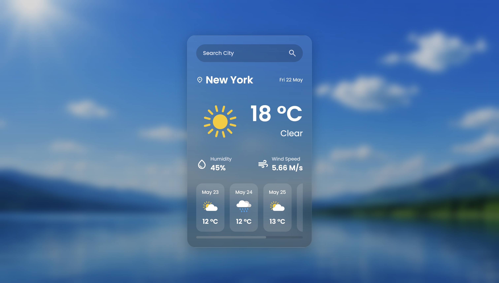

# Weather App

A modern weather application built with HTML, CSS, and JavaScript using the OpenWeatherMap API.

## Preview



---

## Features

- Search weather by city
- Real-time weather information
- Temperature display in Celsius
- Humidity and wind speed data
- 5-day weather forecast
- Dynamic weather icons
- Responsive glassmorphism UI
- Keyboard support with Enter key search

---

## Technologies Used

- HTML5
- CSS3
- JavaScript (Vanilla JS)
- OpenWeatherMap API

---

## Project Structure

```bash
weather-app/
│
├── assets/
│   ├── weather/
│   ├── message/
│   ├── bg.jpg
│   └── preview.png
│
├── index.html
├── style.css
├── script.js
├── README.md
└── .gitignore
```

---

## Installation

### 1. Clone the repository

```bash
git clone https://github.com/Amirjon06/Weather-App.git
```

### 2. Open the project folder

```bash
cd Weather-App
```

### 3. Add your OpenWeatherMap API key

Inside `script.js`:

```js
const apiKey = 'YOUR_API_KEY'
```

### 4. Run the project

Use the VS Code Live Server extension or open `index.html`.

---

## API Used

This project uses the OpenWeatherMap API:

https://openweathermap.org/api

---

## Future Improvements

- Geolocation support
- Dark/light mode toggle
- Better error handling
- Hourly forecast
- Animated weather effects
- Search history
- Unit conversion (°C / °F)
- Deployment with Netlify or Vercel

---

## What I Learned

- DOM manipulation
- Working with APIs
- Async/await and fetch requests
- Dynamic UI rendering
- Event listeners
- Responsive styling with CSS

---

## Author

### Amirjon Abdunayimov

GitHub: https://github.com/Amirjon06
